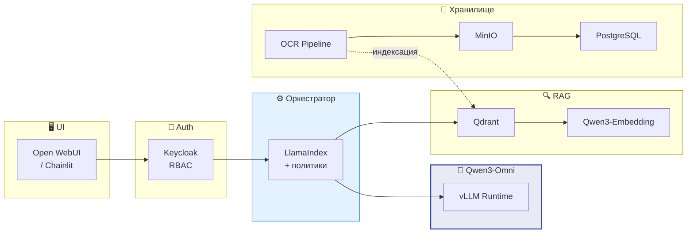
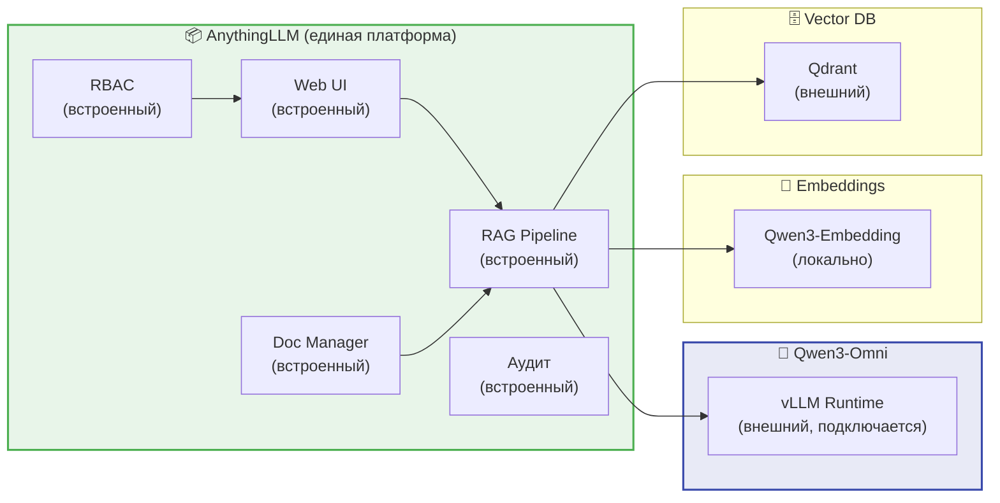
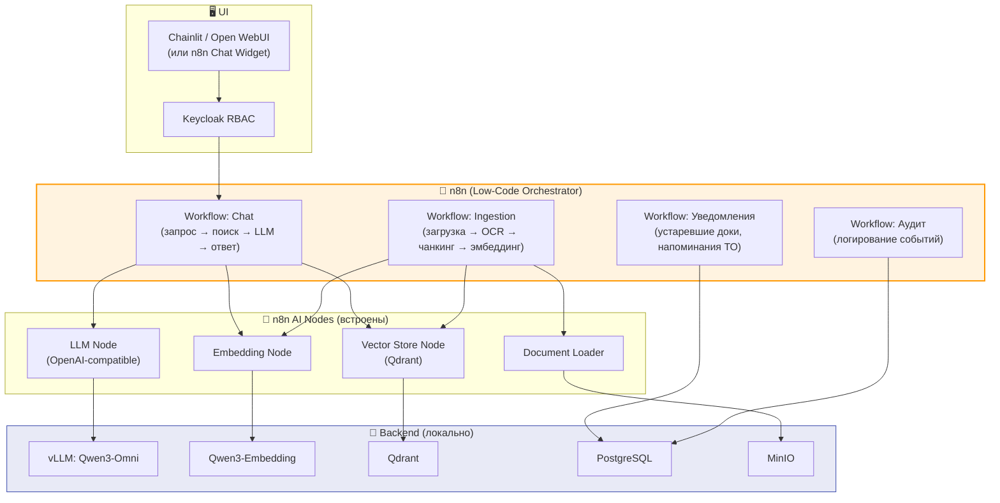
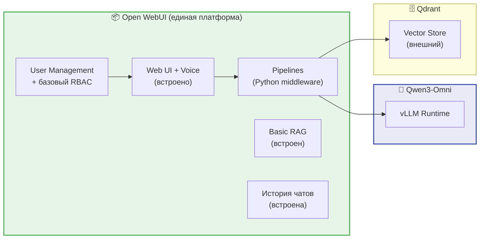
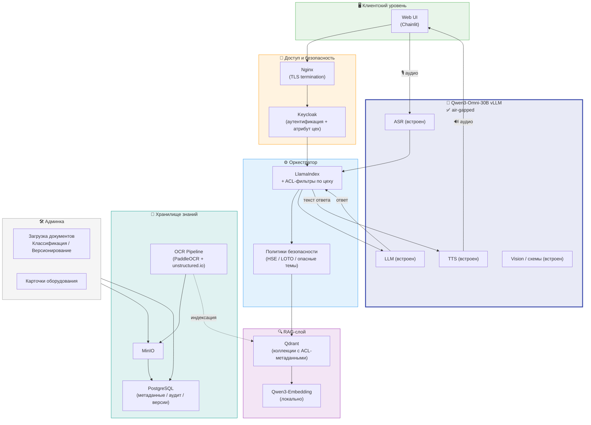
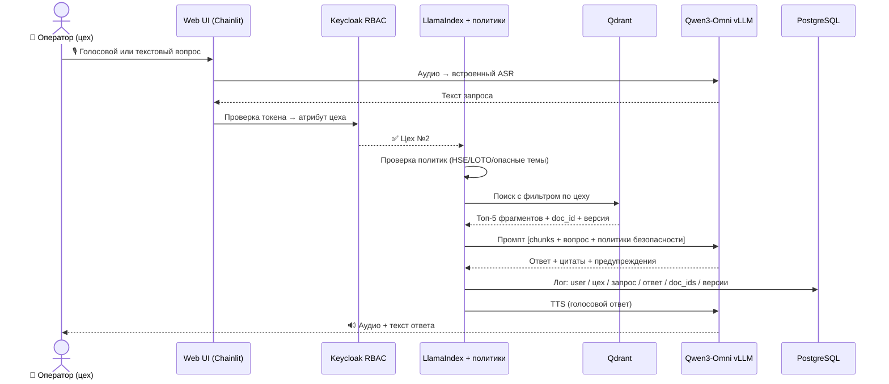
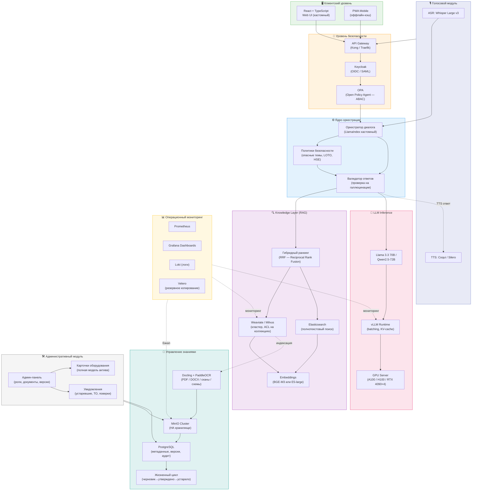
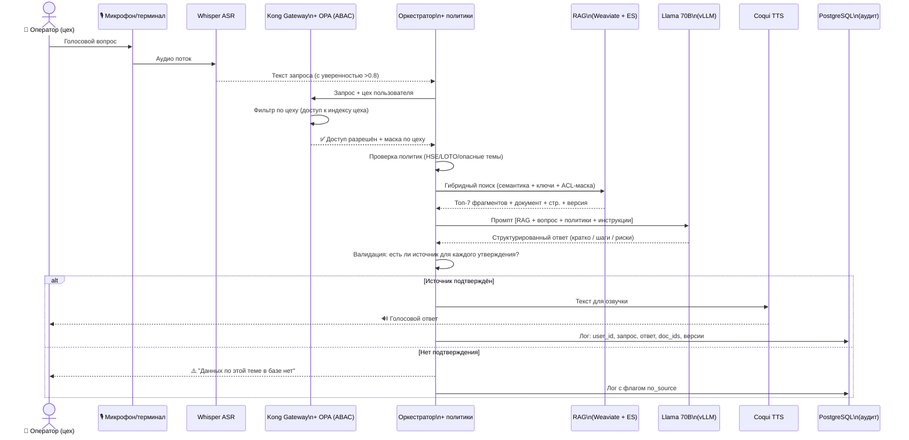
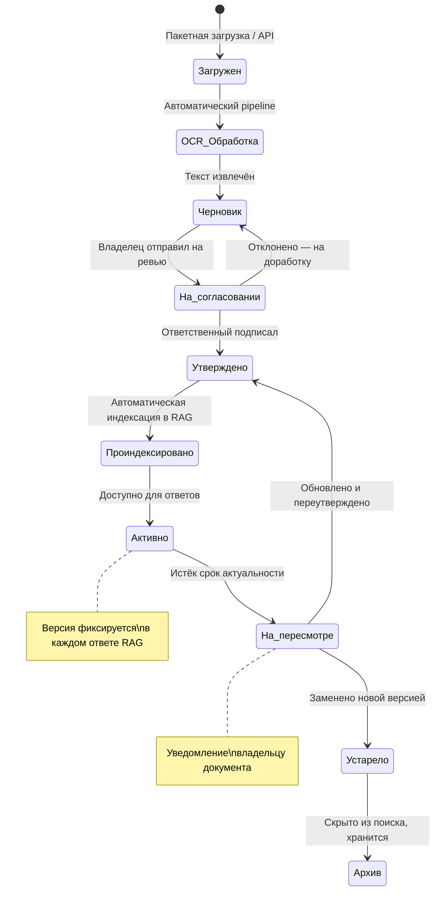
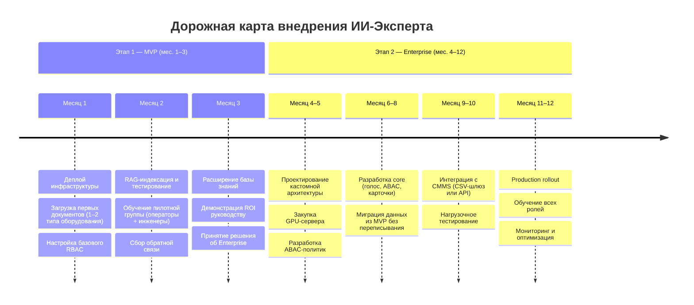

## 1. Резюме анализа требований

### Суть задачи

On-premise RAG-система с локальной LLM, голосовым интерфейсом и строгим разграничением доступа, работающая **полностью офлайн (air-gapped)** для промышленного персонала — от операторов до главных инженеров.

### Функциональные блоки

| # | Блок | Описание |
|---|------|----------|
| F-1 | **Интерфейс** | Web UI + голос (ASR/TTS локально) |
| F-2 | **RAG-ядро** | Поиск по документам + ответы с цитатами |
| F-3 | **Карточки оборудования** | Универсальная модель актива с привязкой документов |
| F-4 | **Управление знаниями** | Загрузка, версионирование, жизненный цикл |
| F-5 | **Доступ по цехам** | Разделение доступов и индексов по цехам |
| F-6 | **Аудит** | Кто спросил, что получил, из каких источников |
| F-7 | **Политики безопасности** | Запрет "выдумок", предупреждения для опасных тем |
| F-8 | **Масштабирование** | От 1 завода до холдинга |

### 🔴 Критические риски

| Риск | Описание | Меры |
|------|----------|------|
| **R-1: LLM vs. ресурсы** | Модели 70B требуют GPU-сервер от $15–30k. 7–13B дают хуже результат | Выбор модели под бюджет железа |
| **R-2: Качество сканов** | 40–70% документации — сканы. Без OCR-pipeline RAG неприемлем | OCR-pipeline в MVP обязателен |
| **R-3: Терминология** | Разные предприятия называют одно по-разному | Словарь синонимов + нормализация |
| **R-4: Интеграции** | ТЗ не упоминает 1С/SAP/Maximo, хотя ЗИП и ТО там | CSV-шлюз как минимум |

---

## 2. Вариант А — MVP «Быстрый старт» (Qwen3-Omni Local)

**Фундамент для всех под-вариантов:** AI-ядром во всех сценариях MVP является **Qwen3-Omni-30B-A3B-Instruct** — локальная Any-to-Any модель, которая заменяет три отдельных сервиса (LLM + ASR + TTS) и работает полностью офлайн.

### Qwen3-Omni-30B-A3B: ключевые характеристики

| Характеристика | Значение |
|---------------|---------|
| **Архитектура** | MoE: 30.5B total params, **~3.3B активных** на токен |
| **Тип** | **Any-to-Any**: аудио / текст / изображение → текст + аудио |
| **LLM / ASR / TTS / Vision** | ✅ Всё встроено в одну модель |
| **Контекст** | 32K (single GPU) / 65K (multi-GPU) |
| **Инференс** | vLLM, OpenAI-совместимый API |
| **Мышление** | Вариант `Thinking` для сложной диагностики |

### Требования к железу (общие для всех под-вариантов MVP)

| Конфигурация | GPU | VRAM | Рекомендация |
|-------------|-----|------|-------------|
| Минимум (AWQ 4-bit) | RTX 4090 | 24 GB | Прототип / пилот |
| Рекомендуется (BF16) | RTX 4090D | 48 GB | Production MVP |
| MVP+ (BF16, tp=4) | 4× RTX 4090 | 4×24 GB | Несколько цехов |

---

### А1 — Custom RAG Stack (LlamaIndex + vLLM + Qdrant)

**Концепция:** Классический custom-стек с полным контролем над каждым компонентом. Максимальная гибкость, но требует разработчиков Python/DevOps.

**Стек:** vLLM + LlamaIndex + Qdrant + Open WebUI + Keycloak + MinIO + PostgreSQL + Docker Compose

| ✅ Плюсы | ❌ Минусы |
|---------|---------|
| Полный контроль над логикой RAG и политиками | Требует Python-разработчик в команде |
| Легко добавить любую кастомную фичу | Больше кода → больше поверхность ошибок |
| Наиболее зрелый путь к Enterprise | Долгий онбординг нового разработчика |
| Богатая экосистема LlamaIndex | Нет GUI для настройки RAG-пайплайна |

**Оценка срока:** 2.5–3.5 месяца | **Стоимость разработки:** $35–55k

---

### А2 — AnythingLLM (All-in-One RAG Platform)

**Концепция:** AnythingLLM — self-hosted платформа с готовым UI, встроенным RAG, управлением пользователями и ролями, поддержкой vLLM как backend. Минимум кода — максимум готовых фич из коробки.

**Стек:** AnythingLLM + vLLM (Qwen3-Omni) + Qdrant + Qwen3-Embedding + Docker Compose

| ✅ Плюсы | ❌ Минусы |
|---------|---------|
| UI + RAG + RBAC + аудит — готово из коробки | Ограниченная кастомизация политик безопасности |
| Минимальный объём разработки (~50% меньше кода) | "Карточки оборудования" придётся строить отдельно |
| Быстрый онбординг команды | Vendor lock-in на AnythingLLM |
| Активное сообщество, частые обновления | Сложнее тестировать логику RAG |
| Отдельный Agent-режим для сложных сценариев | OCR-pipeline всё равно нужно разрабатывать |

**Оценка срока:** 1.5–2.5 месяца | **Стоимость разработки:** $20–35k

---

### А3 — n8n как оркестратор (Low-Code RAG)

**Концепция:** n8n — self-hosted low-code платформа автоматизации с встроенными AI-нодами (LLM, Embeddings, Vector Store, Document Loader). Весь RAG-пайплайн строится визуально в drag-and-drop интерфейсе, без написания кода оркестрации.

**Стек:** n8n (self-hosted) + vLLM (Qwen3-Omni) + Qdrant + Qwen3-Embedding + Chainlit + Keycloak + PostgreSQL + MinIO

#### Что n8n умеет "из коробки" для этого проекта

| Функция | Статус |
|---------|--------|
| Загрузка и обработка документов (PDF, DOCX) | ✅ Document Loader node |
| Эмбеддинг и индексация в Qdrant | ✅ Встроенная интеграция |
| Вызов LLM через OpenAI-compatible API | ✅ LLM Chain node |
| RAG-пайплайн (запрос → поиск → генерация) | ✅ Vector Store QA node |
| Уведомления владельцам (email, Telegram, Slack) | ✅ Native nodes |
| Логирование событий в PostgreSQL | ✅ Postgres node |
| Расписания (напоминания по ТО, актуальность) | ✅ Cron trigger |
| Webhooks для интеграции с внешними системами | ✅ Webhook node |
| Голос (ASR/TTS) | ❌ Через Qwen3-Omni API, нет нативных нод |
| Сложные политики безопасности (LOTO/HSE) | ⚠️ Реализуемо, но требует кастомных нод |
| ABAC / мультитенантность | ❌ Не поддерживается |

#### Когда n8n имеет смысл, а когда — нет

**✅ Имеет смысл использовать n8n для:**
- **Ingestion pipeline** — загрузка, OCR, чанкинг, эмбеддинг, классификация документов. Это идеальный use case: визуальный workflow, легко редактировать без деплоя
- **Уведомления и напоминания** — сроки ТО, устаревшие документы, статусы согласования
- **Интеграции** — CSV-импорт из CMMS, выгрузки отчётов, webhook-хуки
- **Аудит-логирование** — запись событий в PostgreSQL через готовые ноды

**❌ Не имеет смысла использовать n8n для:**
- **Real-time чат** — n8n добавляет latency (HTTP-round-trip на каждый шаг workflow), не поддерживает нативный streaming ответов LLM
- **Сложные политики безопасности** — логику LOTO/HSE/аварийных блокировок лучше кодировать явно, не в визуальных нодах
- **Высокие нагрузки** — n8n не масштабируется горизонтально так же легко, как Python-сервис за vLLM

> **Вывод по n8n:** Оптимальная роль — **вспомогательный слой автоматизации** рядом с основным RAG-стеком, но не его замена. Связка "LlamaIndex/AnythingLLM для чата + n8n для ingestion и уведомлений" — сильное решение.

| ✅ Плюсы | ❌ Минусы |
|---------|---------|
| Ingestion pipeline без единой строчки кода | Latency в real-time чате выше, чем у кастомного стека |
| Визуальные воркфлоу — легко читать и менять | Не поддерживает streaming LLM-ответов нативно |
| Уведомления/расписания/интеграции из коробки | Сложные политики безопасности неудобно реализовывать |
| Self-hosted, данные не покидают контур | Высокие нагрузки требуют очереди (BullMQ) + масштабирование |
| Быстрый onboarding не-разработчиков (инженер ПТО) | Vendor lock-in при росте сложности пайплайнов |

**Оценка срока:** 2–3 месяца (гибридно) | **Стоимость разработки:** $25–40k

---

### А4 — Open WebUI + Pipelines (Ultra-Fast Start)

**Концепция:** Open WebUI — это не просто UI, это полноценная платформа с встроенными Pipelines (Python-middleware), управлением пользователями, историей чатов и базовым RAG. При подключении к vLLM (Qwen3-Omni) запускается за 1–2 дня. Цена — ограниченная гибкость в бизнес-логике.

**Стек:** Open WebUI + Pipelines + vLLM (Qwen3-Omni) + Qdrant + Docker Compose

| ✅ Плюсы | ❌ Минусы |
|---------|---------|
| Самый быстрый старт: 1–2 дня до первого чата | Политики безопасности реализуются через Pipelines (ограничено) |
| Голос (ASR/TTS) через Qwen3-Omni встроен | Карточки оборудования — не поддерживаются |
| История чатов, управление пользователями — готово | Нет полноценного версионирования документов |
| Минимальные затраты на разработку | Аудит поверхностный, не соответствует требованиям ТЗ |
| Активная разработка, большое сообщество | При росте требований — полный рефакторинг |

**Оценка срока:** 1–1.5 месяца | **Стоимость разработки:** $10–20k

---

### Сравнительная матрица вариантов реализации MVP

> Шкала: **1** = плохо → **5** = отлично

| Критерий | А1: Custom Stack | А2: AnythingLLM | А3: n8n (гибрид) | А4: Open WebUI |
| :--- | :---: | :---: | :---: | :---: |
| Скорость запуска | 3 | 4 | 3 | **5** |
| Покрытие требований ТЗ | **5** | 4 | 3 | 2 |
| Гибкость политик безопасности | **5** | 3 | 2 | 3 |
| Простота поддержки (non-dev) | 2 | 4 | **5** | 4 |
| Масштабируемость до Enterprise | **5** | 4 | 3 | 2 |
| Ingestion / автоматизация | 3 | 3 | **5** | 2 |
| Карточки оборудования | **5** | 3 | 3 | 1 |
| Аудит и версионирование | **5** | 4 | 3 | 2 |
| Стоимость разработки | 2 | 4 | 3 | **5** |
| Технический долг | **4** | 3 | 3 | 2 |
| **🔐 Разделение по цехам** (доступы/индексы) | ✅ Полное | ⚠️ Воркспейс = цех | ❌ нет | ❌ нет |
| **🔐 Соответствие ТЗ** (доступ по цехам) | ✅ **Полное** | ⚠️ Воркспейс = цех | ❌ **Нет** | ❌ **Нет** |
| **⭐ ИТОГОВЫЙ БАЛЛ** | **39 / 50** | **36 / 50** | **33 / 50** | **28 / 50** |
| **💰 Стоимость** | $35–55k | $20–35k | $25–40k | $10–20k |
| **⏱️ Срок** | 2.5–3.5 мес. | 1.5–2.5 мес. | 2–3 мес. | 1–1.5 мес. |

> **Вывод по разделению по цехам:** ТЗ требует только разделение доступов и индексов по цехам. А1 даёт полный контроль (отдельные коллекции/индексы на цех). А2 — воркспейс может быть привязан к цеху. А3 и А4 не имеют встроенного разграничения по цехам без кастомной разработки.

### 🏆 Рекомендуемая конфигурация MVP

С учётом требований ТЗ по разделению по цехам рекомендуется **А1 — Custom Stack**:

### 🏆 Рекомендуемая конфигурация MVP (А1: Custom Stack)

#### 🖥️ 1. Клиентский уровень (Client Level)
* **Web UI (Chainlit):** Основной интерфейс чата, поддерживающий потоковую передачу текста и аудио. Выбран за высокую скорость разработки и встроенную поддержку мультимодальности.
    * **Документация (PoC):** [Chainlit Docs](https://docs.chainlit.io/)

#### 🔐 2. Доступ и безопасность (Gateway & Security)
* **Nginx (TLS termination):** Обеспечивает шифрование трафика внутри локальной сети и обратное проксирование.
    * **Документация (PoC):** [Nginx Docs](https://nginx.org/en/docs/)
* **Keycloak (Identity & Access):** Аутентификация и передача атрибута цеха пользователя в оркестратор для фильтрации индексов по цехам.
    * **Документация (PoC):** [Keycloak Guides](https://www.keycloak.org/guides)

#### ⚙️ 3. Оркестратор (Orchestration Layer)
* **LlamaIndex:** Фреймворк для связи LLM с данными. Отвечает за ACL-фильтрацию (доступ к документам) и управление контекстом.
    * **Документация (PoC):** [LlamaIndex Docs](https://docs.llamaindex.ai/)
* **Safety Engine (Guardrails):** Слой логики для блокировки галлюцинаций и проверки запросов на соответствие правилам безопасности (HSE).
    * **Документация (PoC):** [LlamaIndex Guardrails](https://docs.llamaindex.ai/en/stable/examples/cookbooks/llama_guard/)

#### 🔍 4. RAG-слой (Knowledge Retrieval)
* **Qdrant (Vector Database):** Хранилище векторов с фильтрацией по цеху (отдельные коллекции или метаданные по цехам) и версии документа.
    * **Документация (PoC):** [Qdrant Docs](https://qdrant.tech/documentation/)
* **Qwen3-Embedding:** Локальная модель для создания векторных представлений текста.
    * **Документация (PoC):** [HuggingFace - Qwen](https://huggingface.co/Qwen)

#### 🧠 5. AI-ядро (Qwen3-Omni vLLM)
* **vLLM Runtime:** Высокопроизводительный движок для инференса, объединяющий работу с текстом и голосом в одном контейнере.
    * **Документация (PoC):** [vLLM Docs](https://docs.vllm.ai/)
* **Qwen3-Omni-30B:** Мультимодальная модель (Any-to-Any), обрабатывающая голос и изображения напрямую.
    * **Документация (PoC):** [Qwen2.5-VL Blog (Omni Base)](https://qwenlm.github.io/blog/qwen2.5-vl/)

#### 📄 6. Хранилище знаний (Knowledge Storage)
* **OCR Pipeline (PaddleOCR):** Инструмент для распознавания текста на чертежах и сканах.
    * **Документация (PoC):** [PaddleOCR GitHub](https://github.com/PaddlePaddle/PaddleOCR)
* **MinIO:** S3-хранилище для исходных PDF-файлов и медиа-данных.
    * **Документация (PoC):** [MinIO Docs](https://min.io/docs/minio/linux/index.html)
* **PostgreSQL:** БД для хранения логов аудита и структурированных данных об оборудовании.
    * **Документация (PoC):** [PostgreSQL Docs](https://www.postgresql.org/docs/)

Единый стек без внешних зависимостей: LlamaIndex обеспечивает полный контроль над RAG-логикой и фильтрацией по цеху, Keycloak передаёт атрибут цеха для разделения доступов и индексов, Qwen3-Omni через vLLM — LLM + ASR + TTS + Vision в одном процессе. **Стоимость:** $35–55k, **срок:** 2.5–3.5 месяца.

### Поток обработки запроса (рекомендуемый MVP: А1)

### ✅ Итоговые плюсы и ❌ минусы (рекомендуемый MVP: А1)

| ✅ Плюсы | ❌ Минусы |
|---------|---------|
| ✅ Полностью air-gapped, данные не покидают контур | Требует GPU: RTX 4090D ($8–12k) |
| ✅ Разделение доступов и индексов по цехам | Нужен Python-разработчик с опытом LlamaIndex |
| Голос + Vision RAG с первого дня (Qwen3-Omni) | Карточки оборудования — кастомная разработка |
| Единый стек без внешних оркестраторов — проще поддерживать | Нет GUI для настройки RAG-пайплайна (только код) |
| Прямая миграция в Enterprise без смены архитектуры | Срок: 2.5–3.5 мес. — дольше А2/А4 |

> **Обоснование:** A1 Custom Stack — вариант MVP, полностью соответствующий требованиям ТЗ по разделению доступов и индексов по цехам. Единый стек без дополнительных оркестраторов проще в эксплуатации и обеспечивает прямой путь к Enterprise без переписывания ядра.

---

## 2.1 Риски MVP — честная оценка

### 🔴 Qwen3-Omni: ASR и TTS на русском языке

Qwen3-Omni обучалась преимущественно на китайском и английском. **Качество распознавания русской речи** с производственной лексикой — «КИПиА», «ЗИП», «ЛОТО», «пуск/останов», аббревиатуры марок оборудования — не задокументировано на промышленных датасетах и существенно ниже, чем у Whisper Large v3, который имеет подтверждённую точность на русском.

Аналогично с TTS: голоса Ethan / Chelsie / Aiden — английские. Русскоязычный синтез у Qwen3-Omni хуже специализированных Silero TTS или Coqui VITS, обученных на русском.

**Мера снижения риска:** перед финальным выбором провести бенчмарк ASR на записях с терминологией предприятия (20–30 фраз) и сравнить Qwen3-Omni vs. Whisper Large v3. Если качество ASR неприемлемо — использовать Whisper как отдельный сервис + Silero для TTS.

---

### 🔴 vLLM + Qwen3-Omni: нестабильная production-конфигурация

Официальный vLLM поддержку аудио-модальностей Qwen3-Omni получил в форке, а не в основной ветке. Это означает:

- При обновлении vLLM до следующей минорной версии аудио-функциональность может сломаться без предупреждения
- Сообщество поддержки значительно меньше, чем у стандартного vLLM + текстовая LLM
- Баги в обработке аудио могут не исправляться неделями

**Мера снижения риска:** зафиксировать точные версии vLLM и модели на старте MVP и не обновлять без тестирования. Держать Whisper как резервный ASR-сервис на случай деградации.

---

### 🔴 AWQ 4-bit на RTX 4090 (24 GB): не «минимальная конфигурация», а риск качества

MoE-архитектура загружает все 30B весов в память независимо от того, сколько параметров активно на токен. RTX 4090 (24 GB) с AWQ 4-bit квантизацией — это конфигурация с непредсказуемым поведением на длинных технических контекстах (регламенты ТО, многостраничные инструкции). Деградация качества при квантизации на специализированных промышленных текстах не измерена.

**Мера снижения риска:** минимальная рекомендуемая конфигурация для production MVP — RTX 4090D (48 GB) в BF16. AWQ 4-bit использовать только как стендовый прототип для демонстрации, не как production.

---

### 🟠 OCR-pipeline: Tesseract не справится с производственной документацией

Tesseract + unstructured.io нормально работают с чистыми цифровыми PDF. На реальной производственной документации картина другая:

| Тип документа | Tesseract | Нужно |
|--------------|-----------|-------|
| Чистый цифровой PDF | ✅ ~95% | Tesseract |
| Скан нормального качества (300 dpi) | ⚠️ ~80% | Tesseract + preprocessing |
| Скан с печатями, рукописными пометками | ❌ ~50–65% | PaddleOCR + layout analysis |
| Таблицы параметров, многоколоночные каталоги ЗИП | ❌ плохо | Специализированный table extractor |
| Электрические схемы, P&ID, чертежи | ❌ не применимо | Multimodal / Vision pipeline |

Если 30% документов проиндексированы с ошибками OCR — RAG будет давать плохие ответы, и ни одна LLM это не исправит. Ошибка в индексе не видна пользователю — он получит уверенный ответ из неверно распознанного текста.

**Мера снижения риска:** до старта индексации провести аудит корпуса документов по типам и качеству сканирования. Для сканов ниже 200 dpi — обязательный preprocessing (deskew, denoising, upscaling). Для таблиц и схем — PaddleOCR вместо Tesseract. Заложить отдельный бюджет на OCR-pipeline: это не «одна строка в стеке», это отдельный компонент с собственной разработкой.

---

### 🟠 Разделение по цехам в MVP

ТЗ требует **разделение доступов и индексов по цехам**. LlamaIndex не имеет встроенного ACL — фильтрацию по цеху нужно реализовать вручную (отдельные коллекции Qdrant на цех или метаданные + фильтр при запросе). Keycloak передаёт атрибут цеха пользователя (группа, claim или custom attribute).

**Мера снижения риска:** зафиксировать список цехов на старте MVP; один воркспейс/коллекция на цех или единая коллекция с обязательным фильтром по полю `workshop_id`.

---

### 🟡 LlamaIndex как оркестратор: высокий порог входа для команды

LlamaIndex — зрелый фреймворк, но с высокой сложностью отладки. Ошибки в цепочке retrieval → reranking → generation трудно диагностировать без глубокого понимания библиотеки. Онбординг нового разработчика занимает 2–4 недели.

**Мера снижения риска:** на старте MVP обязателен разработчик с опытом именно LlamaIndex (не просто Python/ML). Альтернатива — рассмотреть Haystack как более предсказуемый оркестратор с лучшей документацией политик безопасности.

---

### 🟡 Противоречие в базе знаний: две версии одного документа

ТЗ предусматривает жизненный цикл документа (черновик → согласование → утверждено). Но не описан сценарий: **что отвечает система, если новая версия инструкции «на согласовании», а старая «утверждена»?** RAG вернёт оба документа как релевантные. LLM может синтезировать ответ, смешивающий старые и новые требования.

**Мера снижения риска:** ввести явное правило индексации: в RAG попадают только документы со статусом «утверждено». Документы на согласовании — в отдельном индексе, доступном только владельцам знаний. Зафиксировать это как требование к системе до начала разработки.

---

## 2.2 Уточняющие вопросы для MVP

Без ответов на эти вопросы оценки сроков и стоимости имеют погрешность ±50%.

**В1 — Команда после сдачи:**
Кто будет владельцем системы и её поддержки? Есть ли внутренний IT-специалист с компетенциями Python/DevOps? Если нет — кастомный стек А1 станет неподдерживаемым через 6 месяцев после сдачи, и нужно закладывать контракт на сопровождение.

**В2 — Текущее состояние документации:**
Какой процент документов сейчас в цифровом виде (PDF/DOCX), а какой — только в бумажном или в виде сканов низкого качества? Есть ли уже работающая система управления документами (ECM/DMS/SharePoint), с которой нужна интеграция или миграция? Это напрямую определяет объём OCR-работ и реальный срок первого наполнения базы.

**В3 — Языковая и терминологическая специфика:**
Какие языки используются в документации (русский, английский, оба)? Есть ли уже существующий глоссарий или словарь терминов предприятия? Насколько сильно различается терминология между цехами/площадками? Без этого невозможно оценить сложность embedding-пайплайна и необходимость словаря синонимов.

**В4 — Голосовой ввод:**
Нужен ли голосовой ввод (ASR/TTS) в MVP или это второй этап? Есть ли тестовые записи с терминологией предприятия для бенчмарка ASR?

**В5 — Цеха на старте:**
Какие цеха/площадки подключаются в первой итерации? Разделение индексов по цехам обязательно с первого дня — это учтено в архитектуре.

**В6 — Что считается успехом MVP:**
По каким критериям через 3 месяца будет принято решение — продолжать развивать систему или остановить? Есть ли конкретный бизнес-кейс (снижение времени поиска инструкции, уменьшение обращений к экспертам, сокращение простоев)? Без измеримых критериев успеха MVP превратится в бесконечный pilot.

---

## 3. Вариант Б — Enterprise On-Prem (Полная архитектура)

**Концепция:** Полноценная production-ready система с голосом, ABAC, версионированием, мониторингом и поддержкой масштабирования до уровня холдинга. Строится под все требования ТЗ с первого дня.

### Архитектура Enterprise

### Поток обработки голосового запроса (Enterprise)

### Жизненный цикл документа (Enterprise)

### Технологический стек Enterprise

| Компонент | Технология | Обоснование |
|-----------|-----------|-------------|
| LLM Inference | vLLM + Llama 3.3 70B / Qwen2.5-72B | Батчинг, высокая производительность |
| RAG Framework | LlamaIndex (кастомный оркестратор) | Гибкие политики фильтрации |
| Vector DB | Weaviate / Milvus (кластер) | ACL на уровне коллекций, HA |
| Полнотекстовый поиск | Elasticsearch | Поиск по точным терминам и кодам |
| OCR | Docling + PaddleOCR | Сканы, схемы, P&ID |
| ASR | Whisper Large v3 | Локальный ASR |
| TTS | Coqui TTS / Silero | Русскоязычный синтез |
| Web UI | React + TypeScript (кастом) | Полный контроль над UX |
| Auth / AuthZ | Keycloak + OPA | RBAC + ABAC, политики в коде |
| API Gateway | Kong / Traefik | Rate limiting, аудит запросов |
| Хранилище | MinIO Cluster (HA) | Высокая доступность |
| БД | PostgreSQL | Версии, аудит, метаданные |
| Мониторинг | Grafana + Prometheus + Loki | Полная наблюдаемость |
| Резервирование | Velero + резервный узел | RPO/RTO для production |
| Деплой | Kubernetes (k3s) | Масштабирование до холдинга |

### ✅ Плюсы и ❌ Минусы

| ✅ Плюсы | ❌ Минусы |
|---------|---------|
| Полное покрытие всех требований ТЗ | Стоимость разработки: $150–250k |
| Высокое качество 70B на тех. текстах | Срок: 6–10 месяцев |
| Масштабируется до холдинга | GPU-сервер: $20–40k отдельно |
| Полноценный RBAC/ABAC + детальный аудит | Требует DevOps-компетенций в команде |
| Голос работает из коробки (цех) | Сложнее поддерживать без IT-персонала |
| Production-grade надёжность и HA | — |

> **Обоснование:** Выбирайте Вариант Б, если есть чёткий бизнес-кейс (снижение простоев, замена уходящих экспертов) и жёсткие требования к ИБ. Это не инструмент — это **стратегический актив предприятия**.

---

## 4. Сравнительная матрица принятия решений

> Шкала: **1** = плохо / дорого / рискованно → **5** = отлично / дёшево / надёжно

| Критерий | 🟢 А: MVP (Qwen3-Omni) | 🔵 Б: Enterprise |
| :--- | :---: | :---: |
| Стоимость разработки | **5** | 3 |
| Время выхода на рынок (TTM) | **4** | 2 |
| Качество ответов LLM | **4** | **5** |
| Масштабируемость | 2 | **5** |
| Покрытие требований ТЗ | **4** | **5** |
| Сложность поддержки | **4** | 3 |
| Безопасность / ABAC | 2 | **5** |
| Соответствие требованию air-gapped | ✅ **5** | ✅ **5** |
| Голос (ASR+TTS) | **5** ⬆️ | **5** |
| Vision / мультимодальность | **4** ⬆️ | **5** |
| Надёжность / резервирование | 2 | **5** |
| Технический долг | **4** | **4** |
| **⭐ ИТОГОВЫЙ БАЛЛ** | **43 / 60** | **52 / 60** |
| **💰 Стоимость разработки** | $25–50k | $150–250k |
| **🖥️ Железо** | $5–12k (RTX 4090 / RTX 4090D) | $20–40k (A100/H100) |
| **⏱️ Срок** | 2–3 мес. | 6–10 мес. |

> **Ключевое изменение vs. предыдущей итерации:** Qwen3-Omni возвращает MVP в статус air-gapped (5/5), добавляет встроенный голос и Vision RAG, при этом стоимость железа растёт лишь до $5–12k — против $20–40k в Enterprise. Разрыв в итоговом балле сократился с 12 до 9 пунктов.

### 💡 Рекомендуемая стратегия — двухэтапный подход

---

## 5. Дополнительные рекомендации (Backlog Expansion)

**1. 🔍 Визуальный RAG (Multimodal)**
Работа не только с текстом, но и с электросхемами, P&ID, чертежами — поиск по изображениям и ответы с указанием узла на схеме. Модели Qwen2-VL / LLaVA позволяют реализовать это локально.

**2. 📊 Проактивные уведомления**
Система сама отслеживает приближающиеся сроки ТО, истечение поверок, устаревание документов и уведомляет ответственных. Превращает пассивный справочник в активного помощника.

**3. 🗣️ Петля обратной связи**
Кнопка «ответ полезен / не полезен» + возможность инженеру поправить ответ с попаданием в очередь валидации. Постепенно повышает качество базы без дополнительного ресурса.

**4. 🔗 CSV/Excel-шлюз к CMMS**
Даже без полной интеграции с SAP/1С — импорт данных по ЗИП и оборудованию через файловый шлюз устраняет ручное дублирование и держит карточки актуальными.

**5. 📱 PWA-режим для обходов**
Прогрессивное веб-приложение с кэшем последних N документов — для работы в зонах без Wi-Fi (резервуарные парки, удалённые объекты). Критично для распределённых производств.

---

## 6. Уточняющие вопросы

| # | Вопрос | Влияние на архитектуру |
|---|--------|----------------------|
| 1 | Есть ли выделенный GPU-сервер? Каков бюджет на железо? | Определяет класс LLM (14B vs 70B) |
| 2 | Сколько документов на старте? Доля сканов vs. электронных? | Объём OCR-работ, срок наполнения базы |
| 3 | Голос нужен в MVP или это второй этап? | Выбор ASR (Qwen3-Omni встроенный vs. Whisper) |
| 4 | Сколько одновременных пользователей? Площадок в перспективе 1–3 лет? | Docker Compose vs. Kubernetes |
| 5 | Используется ли CMMS (Maximo, SAP PM, 1С:ТОиР)? | Интеграция или CSV-шлюз |

---

## 7. Соответствие требованиям (requirements.md)

Проверка архитектурного анализа на покрытие требований из `requirements.md`:

| Раздел требований | Покрытие в review.md | Примечание |
|-------------------|----------------------|------------|
| **§1 Контекст** | ✅ | Универсальное решение, голос+текст, локальный контур, air-gapped — в резюме и по всему документу |
| **§2 Цель системы** | ✅ | Внутренний эксперт: голос/текст, ответы с цитатами, работа с документами, RBAC, аудит, версионирование — блоки F-1–F-8, поток запроса, политики |
| **§3 Пользователи и роли** | ✅ | Разделение доступов и индексов по цехам — Keycloak (атрибут цех), фильтрация в RAG по цеху |
| **§4 Use Cases** | ✅ | Быстрые ответы, навигация по знаниям, диагностика — sequence-диаграммы, сценарии в тексте |
| **§5 Принципы качества** | ✅ | RAG с цитатами; режим «нет данных» (Enterprise); политики HSE/LOTO; RBAC/ABAC + аудит; версионирование и ЖЦ документа — state diagram |
| **§6.1 Интерфейсы** | ✅ | Web UI (основной интерфейс); опционально мобильный web (PWA в Enterprise); локальные ASR и TTS — Qwen3-Omni / Whisper, Coqui/Silero |
| **§6.2 Поиск и ответы** | ✅ | PDF/DOCX/XLSX, сканы, OCR (PaddleOCR, Docling); ответы: кратко, пошагово, источники, блок рисков — в оркестраторе и политиках |
| **§6.3 Карточки оборудования** | ✅ | Универсальная модель актива — админка, раздел DOCS в Enterprise, F-3 |
| **§6.4 Управление знаниями** | ✅ | Загрузка, классификация, владелец; разметка важности; контроль актуальности — админка, жизненный цикл, уведомления |
| **§7 Нефункциональные** | ✅ | Офлайн (air-gapped); безопасность (TLS, Keycloak); надёжность и мониторинг (Enterprise: Velero, Prometheus, Grafana); масштабируемость (от завода до холдинга) |
| **§8 Архитектура** | ✅ | Все 8 компонентов (UI+голос, API/Gateway, оркестратор, RAG, LLM, ASR/TTS, админка, логи) представлены в диаграммах MVP и Enterprise |
| **§9 Источники знаний** | ⚠️ | Типы документов упомянуты по тексту (инструкции, ТО, HSE, схемы, ЗИП); отдельного перечня как в §9 нет — допустимо при наличии в сценариях |
| **§10 MVP** | ✅ | Загрузка 1–2 типов оборудования, чат+голос, ответы с цитатами, карточки, роли, аудит и версии — Вариант А и рекомендуемый стек А1 |
| **§11 Метрики успеха** | ⚠️ | Явного блока «метрики успеха» нет; частично отражено в рисках и рекомендациях (качество ответов, время поиска) |
| **§12 Риски и меры** | ✅ | Раздел 2.1 «Риски MVP», OCR/сканы, устаревшие инструкции, терминология, ИБ — с мерами снижения |
| **§13 Deliverables** | ⚠️ | Архитектура, политики, карточки, MVP, регламент, тест-кейсы — по документу покрыты, но чек-лист сдачи не выделен отдельно |

**Итог:** Документ **соответствует** функциональным и нефункциональным требованиям `requirements.md`. Рекомендуемые доработки: при необходимости добавить явный перечень источников знаний (§9), блок метрик успеха (§11) и чек-лист Deliverables (§13) для приёмки.

---

> **Итоговая рекомендация архитектора:** Начать с **Варианта А** на реальных документах одного цеха. Это даст команде опыт работы с данными, покажет узкие места и создаст обоснование для инвестиций в **Вариант Б**. Не строить сразу Enterprise без подтверждённого внутреннего product-market fit.
