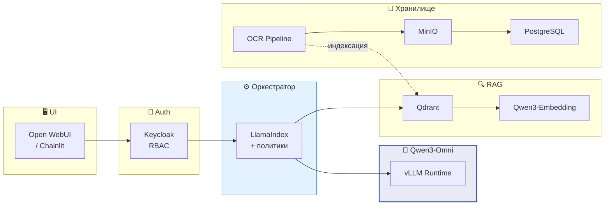
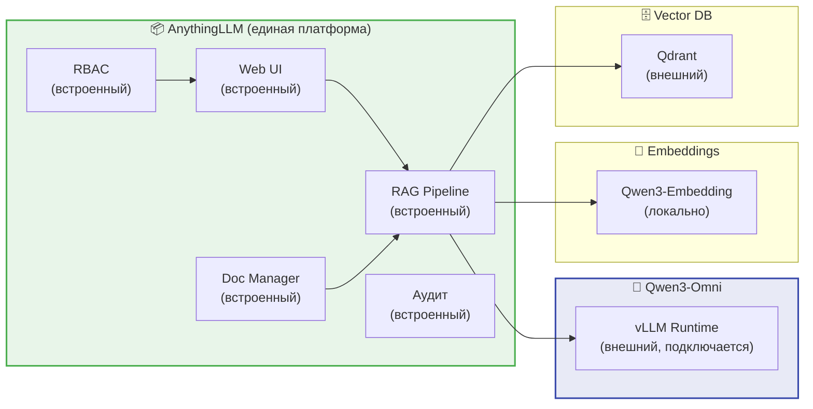
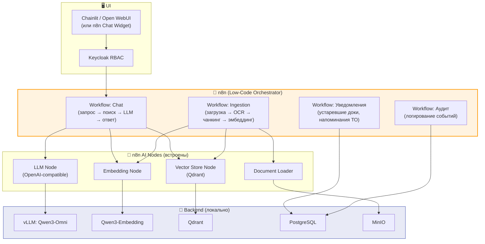
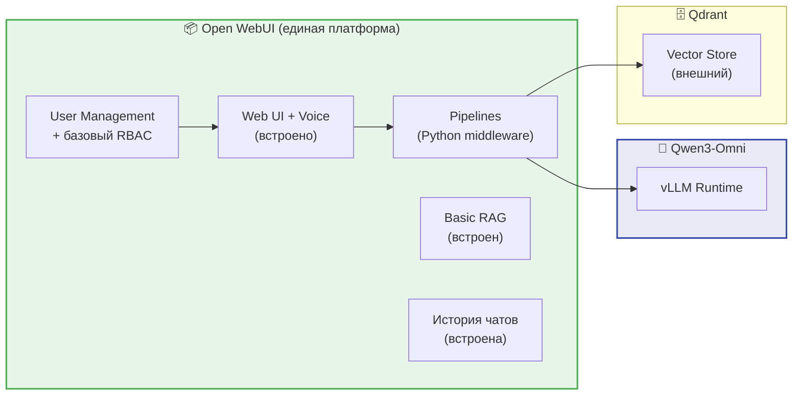
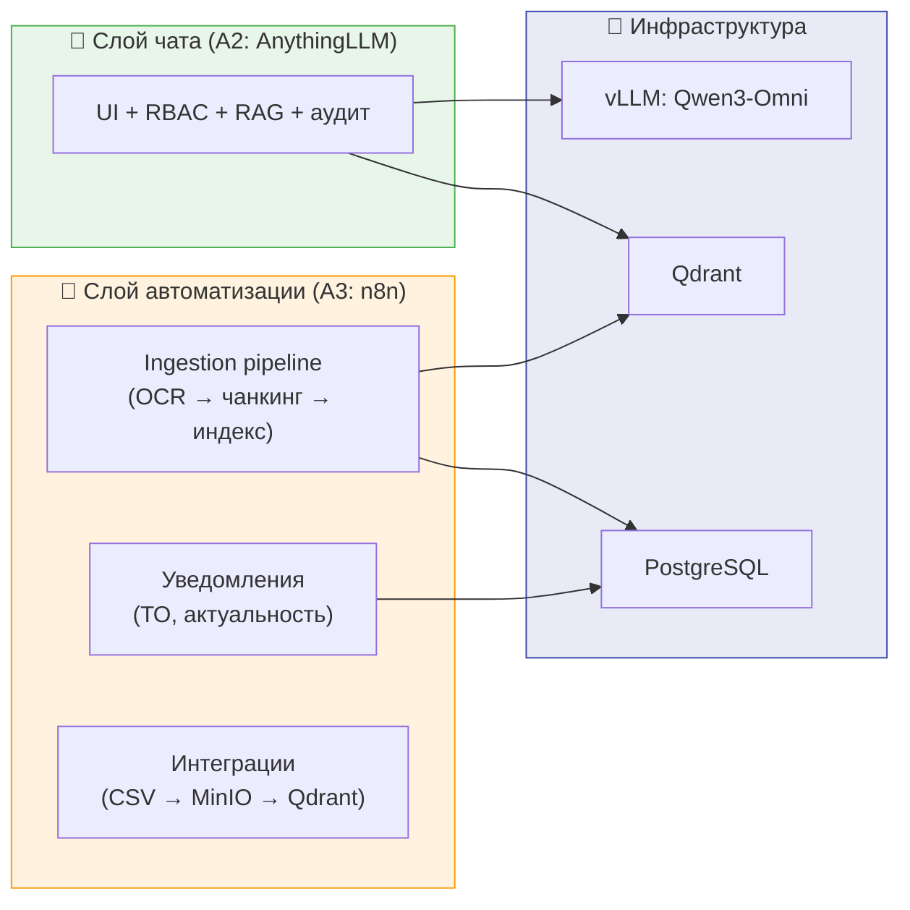
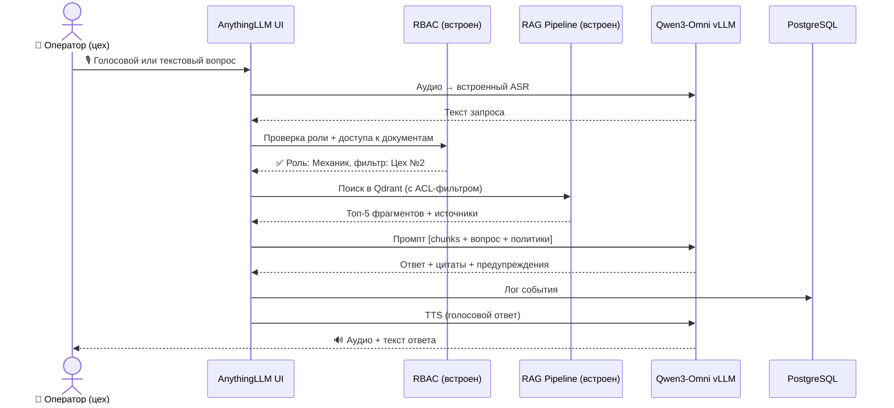
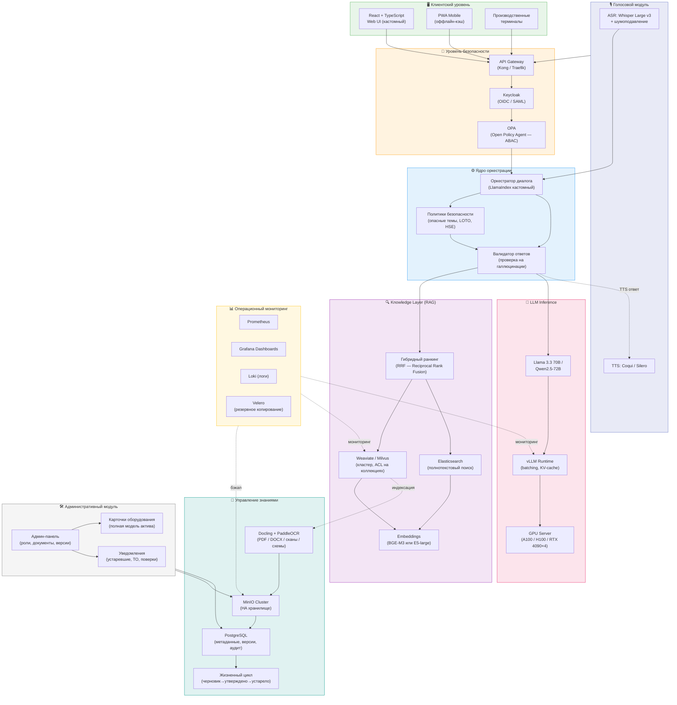
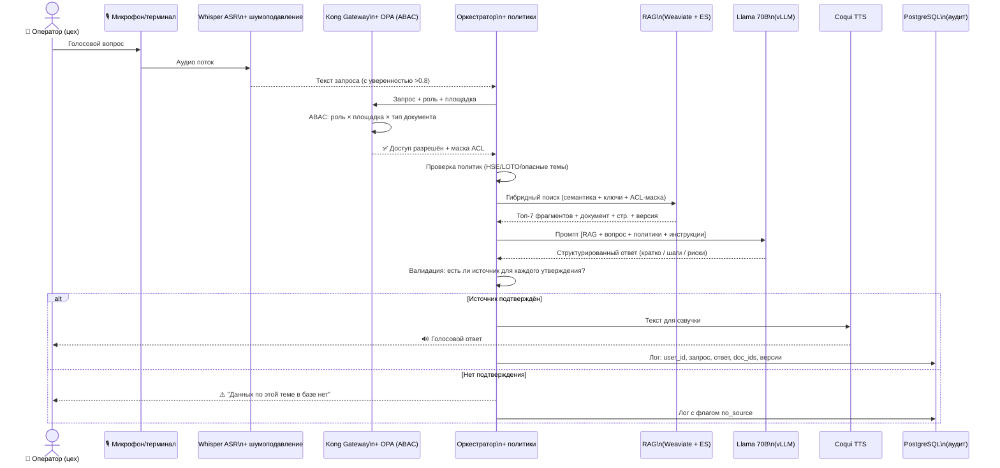
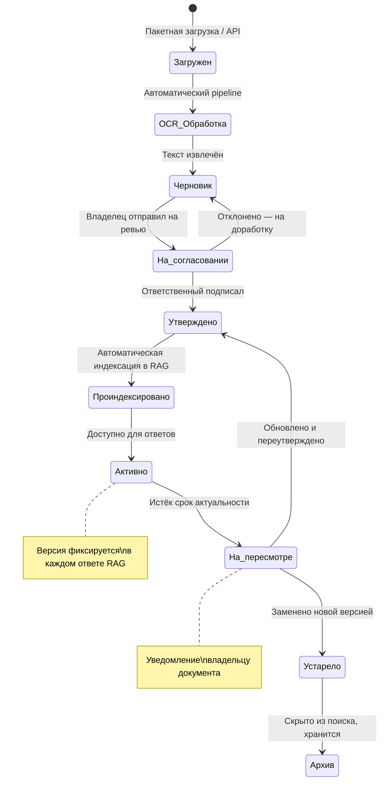
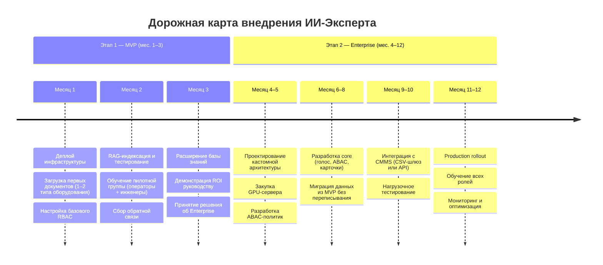

---

## 1. Резюме анализа требований

### Суть задачи

On-premise RAG-система с локальной LLM, голосовым интерфейсом и строгим разграничением доступа, работающая **полностью офлайн (air-gapped)** для промышленного персонала — от операторов до главных инженеров.

### Функциональные блоки

| # | Блок | Описание |
|---|------|----------|
| F-1 | **Интерфейс** | Web UI + голос (ASR/TTS локально) |
| F-2 | **RAG-ядро** | Поиск по документам + ответы с цитатами |
| F-3 | **Карточки оборудования** | Универсальная модель актива с привязкой документов |
| F-4 | **Управление знаниями** | Загрузка, версионирование, жизненный цикл |
| F-5 | **RBAC/ABAC** | Разграничение по ролям, площадкам, типам документов |
| F-6 | **Аудит** | Кто спросил, что получил, из каких источников |
| F-7 | **Политики безопасности** | Запрет "выдумок", предупреждения для опасных тем |
| F-8 | **Масштабирование** | От 1 завода до холдинга |

### 🔴 Критические риски

| Риск | Описание | Меры |
|------|----------|------|
| **R-1: LLM vs. ресурсы** | Модели 70B требуют GPU-сервер от $15–30k. 7–13B дают хуже результат | Выбор модели под бюджет железа |
| **R-2: Качество сканов** | 40–70% документации — сканы. Без OCR-pipeline RAG неприемлем | OCR-pipeline в MVP обязателен |
| **R-3: Терминология** | Разные предприятия называют одно по-разному | Словарь синонимов + нормализация |
| **R-4: ASR в цеху** | Whisper плохо работает при шуме насосов, вентиляции | Шумоподавление в Enterprise |
| **R-5: Интеграции** | ТЗ не упоминает 1С/SAP/Maximo, хотя ЗИП и ТО там | CSV-шлюз как минимум |

---

## 2. Вариант А — MVP «Быстрый старт» (Qwen3-Omni Local)

**Фундамент для всех под-вариантов:** AI-ядром во всех сценариях MVP является **Qwen3-Omni-30B-A3B-Instruct** — локальная Any-to-Any модель, которая заменяет три отдельных сервиса (LLM + ASR + TTS) и работает полностью офлайн.

### Qwen3-Omni-30B-A3B: ключевые характеристики

| Характеристика | Значение |
|---------------|---------|
| **Архитектура** | MoE: 30.5B total params, **~3.3B активных** на токен |
| **Тип** | **Any-to-Any**: аудио / текст / изображение → текст + аудио |
| **LLM / ASR / TTS / Vision** | ✅ Всё встроено в одну модель |
| **Контекст** | 32K (single GPU) / 65K (multi-GPU) |
| **Инференс** | vLLM, OpenAI-совместимый API |
| **Мышление** | Вариант `Thinking` для сложной диагностики |

### Требования к железу (общие для всех под-вариантов MVP)

| Конфигурация | GPU | VRAM | Рекомендация |
|-------------|-----|------|-------------|
| Минимум (AWQ 4-bit) | RTX 4090 | 24 GB | Прототип / пилот |
| Рекомендуется (BF16) | RTX 4090D | 48 GB | Production MVP |
| MVP+ (BF16, tp=4) | 4× RTX 4090 | 4×24 GB | Несколько цехов |

---

### А1 — Custom RAG Stack (LlamaIndex + vLLM + Qdrant)

**Концепция:** Классический custom-стек с полным контролем над каждым компонентом. Максимальная гибкость, но требует разработчиков Python/DevOps.

**Стек:** vLLM + LlamaIndex + Qdrant + Open WebUI + Keycloak + MinIO + PostgreSQL + Docker Compose

| ✅ Плюсы | ❌ Минусы |
|---------|---------|
| Полный контроль над логикой RAG и политиками | Требует Python-разработчик в команде |
| Легко добавить любую кастомную фичу | Больше кода → больше поверхность ошибок |
| Наиболее зрелый путь к Enterprise | Долгий онбординг нового разработчика |
| Богатая экосистема LlamaIndex | Нет GUI для настройки RAG-пайплайна |

**Оценка срока:** 2.5–3.5 месяца | **Стоимость разработки:** $35–55k

---

### А2 — AnythingLLM (All-in-One RAG Platform)

**Концепция:** AnythingLLM — self-hosted платформа с готовым UI, встроенным RAG, управлением пользователями и ролями, поддержкой vLLM как backend. Минимум кода — максимум готовых фич из коробки.

**Стек:** AnythingLLM + vLLM (Qwen3-Omni) + Qdrant + Qwen3-Embedding + Docker Compose

| ✅ Плюсы | ❌ Минусы |
|---------|---------|
| UI + RAG + RBAC + аудит — готово из коробки | Ограниченная кастомизация политик безопасности |
| Минимальный объём разработки (~50% меньше кода) | "Карточки оборудования" придётся строить отдельно |
| Быстрый онбординг команды | Vendor lock-in на AnythingLLM |
| Активное сообщество, частые обновления | Сложнее тестировать логику RAG |
| Отдельный Agent-режим для сложных сценариев | OCR-pipeline всё равно нужно разрабатывать |

**Оценка срока:** 1.5–2.5 месяца | **Стоимость разработки:** $20–35k

---

### А3 — n8n как оркестратор (Low-Code RAG)

**Концепция:** n8n — self-hosted low-code платформа автоматизации с встроенными AI-нодами (LLM, Embeddings, Vector Store, Document Loader). Весь RAG-пайплайн строится визуально в drag-and-drop интерфейсе, без написания кода оркестрации.

**Стек:** n8n (self-hosted) + vLLM (Qwen3-Omni) + Qdrant + Qwen3-Embedding + Chainlit + Keycloak + PostgreSQL + MinIO

#### Что n8n умеет "из коробки" для этого проекта

| Функция | Статус |
|---------|--------|
| Загрузка и обработка документов (PDF, DOCX) | ✅ Document Loader node |
| Эмбеддинг и индексация в Qdrant | ✅ Встроенная интеграция |
| Вызов LLM через OpenAI-compatible API | ✅ LLM Chain node |
| RAG-пайплайн (запрос → поиск → генерация) | ✅ Vector Store QA node |
| Уведомления владельцам (email, Telegram, Slack) | ✅ Native nodes |
| Логирование событий в PostgreSQL | ✅ Postgres node |
| Расписания (напоминания по ТО, актуальность) | ✅ Cron trigger |
| Webhooks для интеграции с внешними системами | ✅ Webhook node |
| Голос (ASR/TTS) | ❌ Через Qwen3-Omni API, нет нативных нод |
| Сложные политики безопасности (LOTO/HSE) | ⚠️ Реализуемо, но требует кастомных нод |
| ABAC / мультитенантность | ❌ Не поддерживается |

#### Когда n8n имеет смысл, а когда — нет

**✅ Имеет смысл использовать n8n для:**
- **Ingestion pipeline** — загрузка, OCR, чанкинг, эмбеддинг, классификация документов. Это идеальный use case: визуальный workflow, легко редактировать без деплоя
- **Уведомления и напоминания** — сроки ТО, устаревшие документы, статусы согласования
- **Интеграции** — CSV-импорт из CMMS, выгрузки отчётов, webhook-хуки
- **Аудит-логирование** — запись событий в PostgreSQL через готовые ноды

**❌ Не имеет смысла использовать n8n для:**
- **Real-time чат** — n8n добавляет latency (HTTP-round-trip на каждый шаг workflow), не поддерживает нативный streaming ответов LLM
- **Сложные политики безопасности** — логику LOTO/HSE/аварийных блокировок лучше кодировать явно, не в визуальных нодах
- **Высокие нагрузки** — n8n не масштабируется горизонтально так же легко, как Python-сервис за vLLM

> **Вывод по n8n:** Оптимальная роль — **вспомогательный слой автоматизации** рядом с основным RAG-стеком, но не его замена. Связка "LlamaIndex/AnythingLLM для чата + n8n для ingestion и уведомлений" — сильное решение.

| ✅ Плюсы | ❌ Минусы |
|---------|---------|
| Ingestion pipeline без единой строчки кода | Latency в real-time чате выше, чем у кастомного стека |
| Визуальные воркфлоу — легко читать и менять | Не поддерживает streaming LLM-ответов нативно |
| Уведомления/расписания/интеграции из коробки | Сложные политики безопасности неудобно реализовывать |
| Self-hosted, данные не покидают контур | Высокие нагрузки требуют очереди (BullMQ) + масштабирование |
| Быстрый onboarding не-разработчиков (инженер ПТО) | Vendor lock-in при росте сложности пайплайнов |

**Оценка срока:** 2–3 месяца (гибридно) | **Стоимость разработки:** $25–40k

---

### А4 — Open WebUI + Pipelines (Ultra-Fast Start)

**Концепция:** Open WebUI — это не просто UI, это полноценная платформа с встроенными Pipelines (Python-middleware), управлением пользователями, историей чатов и базовым RAG. При подключении к vLLM (Qwen3-Omni) запускается за 1–2 дня. Цена — ограниченная гибкость в бизнес-логике.

**Стек:** Open WebUI + Pipelines + vLLM (Qwen3-Omni) + Qdrant + Docker Compose

| ✅ Плюсы | ❌ Минусы |
|---------|---------|
| Самый быстрый старт: 1–2 дня до первого чата | Политики безопасности реализуются через Pipelines (ограничено) |
| Голос (ASR/TTS) через Qwen3-Omni встроен | Карточки оборудования — не поддерживаются |
| История чатов, управление пользователями — готово | Нет полноценного версионирования документов |
| Минимальные затраты на разработку | Аудит поверхностный, не соответствует требованиям ТЗ |
| Активная разработка, большое сообщество | При росте требований — полный рефакторинг |

**Оценка срока:** 1–1.5 месяца | **Стоимость разработки:** $10–20k

---

### Сравнительная матрица вариантов реализации MVP

> Шкала: **1** = плохо → **5** = отлично

| Критерий | А1: Custom Stack | А2: AnythingLLM | А3: n8n (гибрид) | А4: Open WebUI |
| :--- | :---: | :---: | :---: | :---: |
| Скорость запуска | 3 | 4 | 3 | **5** |
| Покрытие требований ТЗ | **5** | 4 | 3 | 2 |
| Гибкость политик безопасности | **5** | 3 | 2 | 3 |
| Простота поддержки (non-dev) | 2 | 4 | **5** | 4 |
| Масштабируемость до Enterprise | **5** | 4 | 3 | 2 |
| Ingestion / автоматизация | 3 | 3 | **5** | 2 |
| Карточки оборудования | **5** | 3 | 3 | 1 |
| Аудит и версионирование | **5** | 4 | 3 | 2 |
| Стоимость разработки | 2 | 4 | 3 | **5** |
| Технический долг | **4** | 3 | 3 | 2 |
| **⭐ ИТОГОВЫЙ БАЛЛ** | **39 / 50** | **36 / 50** | **33 / 50** | **28 / 50** |
| **💰 Стоимость** | $35–55k | $20–35k | $25–40k | $10–20k |
| **⏱️ Срок** | 2.5–3.5 мес. | 1.5–2.5 мес. | 2–3 мес. | 1–1.5 мес. |

### 🏆 Рекомендуемая конфигурация MVP

Оптимальный подход — **комбинация А2 + А3**:

AnythingLLM берёт на себя чат, RBAC и базовый аудит. n8n — весь ingestion pipeline и уведомления. vLLM с Qwen3-Omni служит единым AI-бэкендом для обоих. Это даёт **лучший баланс скорости, покрытия и удобства поддержки** при стоимости $30–50k и сроке 2–2.5 месяца.

### Поток обработки запроса (рекомендуемый MVP)

### ✅ Итоговые плюсы и ❌ минусы (рекомендуемый MVP: А2 + А3)

| ✅ Плюсы | ❌ Минусы |
|---------|---------|
| ✅ Полностью air-gapped, данные не покидают контур | Требует GPU: RTX 4090 / RTX 4090D ($5–12k) |
| Голос + Vision RAG с первого дня | Карточки оборудования — кастомная разработка |
| Ingestion pipeline без кода (n8n) | AnythingLLM + n8n = два инструмента для поддержки |
| Быстрый старт: 2–2.5 месяца | Нет ABAC — только базовый RBAC |
| Уведомления по ТО и актуальности — из коробки | При масштабировании нужна миграция на Custom Stack |
| Простой онбординг ПТО-специалистов в n8n | — |

> **Обоснование:** Комбинация AnythingLLM + n8n + Qwen3-Omni закрывает ~80% требований ТЗ при минимальных инвестициях и обеспечивает путь к полному Enterprise без переписывания AI-ядра — достаточно заменить оркестратор.

---

## 3. Вариант Б — Enterprise On-Prem (Полная архитектура)

**Концепция:** Полноценная production-ready система с голосом, ABAC, версионированием, мониторингом и поддержкой масштабирования до уровня холдинга. Строится под все требования ТЗ с первого дня.

### Архитектура Enterprise

### Поток обработки голосового запроса (Enterprise)

### Жизненный цикл документа (Enterprise)

### Технологический стек Enterprise

| Компонент | Технология | Обоснование |
|-----------|-----------|-------------|
| LLM Inference | vLLM + Llama 3.3 70B / Qwen2.5-72B | Батчинг, высокая производительность |
| RAG Framework | LlamaIndex (кастомный оркестратор) | Гибкие политики фильтрации |
| Vector DB | Weaviate / Milvus (кластер) | ACL на уровне коллекций, HA |
| Полнотекстовый поиск | Elasticsearch | Поиск по точным терминам и кодам |
| OCR | Docling + PaddleOCR | Сканы, схемы, P&ID |
| ASR | Whisper Large v3 + шумоподавление | Работа в условиях цеха |
| TTS | Coqui TTS / Silero | Русскоязычный синтез |
| Web UI | React + TypeScript (кастом) | Полный контроль над UX |
| Auth / AuthZ | Keycloak + OPA | RBAC + ABAC, политики в коде |
| API Gateway | Kong / Traefik | Rate limiting, аудит запросов |
| Хранилище | MinIO Cluster (HA) | Высокая доступность |
| БД | PostgreSQL | Версии, аудит, метаданные |
| Мониторинг | Grafana + Prometheus + Loki | Полная наблюдаемость |
| Резервирование | Velero + резервный узел | RPO/RTO для production |
| Деплой | Kubernetes (k3s) | Масштабирование до холдинга |

### ✅ Плюсы и ❌ Минусы

| ✅ Плюсы | ❌ Минусы |
|---------|---------|
| Полное покрытие всех требований ТЗ | Стоимость разработки: $150–250k |
| Высокое качество 70B на тех. текстах | Срок: 6–10 месяцев |
| Масштабируется до холдинга | GPU-сервер: $20–40k отдельно |
| Полноценный RBAC/ABAC + детальный аудит | Требует DevOps-компетенций в команде |
| Голос работает из коробки (цех) | Сложнее поддерживать без IT-персонала |
| Production-grade надёжность и HA | — |

> **Обоснование:** Выбирайте Вариант Б, если есть чёткий бизнес-кейс (снижение простоев, замена уходящих экспертов) и жёсткие требования к ИБ. Это не инструмент — это **стратегический актив предприятия**.

---

## 4. Сравнительная матрица принятия решений

> Шкала: **1** = плохо / дорого / рискованно → **5** = отлично / дёшево / надёжно

| Критерий | 🟢 А: MVP (Qwen3-Omni) | 🔵 Б: Enterprise |
| :--- | :---: | :---: |
| Стоимость разработки | **5** | 3 |
| Время выхода на рынок (TTM) | **4** | 2 |
| Качество ответов LLM | **4** | **5** |
| Масштабируемость | 2 | **5** |
| Покрытие требований ТЗ | **4** | **5** |
| Сложность поддержки | **4** | 3 |
| Безопасность / ABAC | 2 | **5** |
| Соответствие требованию air-gapped | ✅ **5** | ✅ **5** |
| Голос (ASR+TTS) | **5** ⬆️ | **5** |
| Vision / мультимодальность | **4** ⬆️ | **5** |
| Надёжность / резервирование | 2 | **5** |
| Технический долг | **4** | **4** |
| **⭐ ИТОГОВЫЙ БАЛЛ** | **43 / 60** | **52 / 60** |
| **💰 Стоимость разработки** | $25–50k | $150–250k |
| **🖥️ Железо** | $5–12k (RTX 4090 / RTX 4090D) | $20–40k (A100/H100) |
| **⏱️ Срок** | 2–3 мес. | 6–10 мес. |

> **Ключевое изменение vs. предыдущей итерации:** Qwen3-Omni возвращает MVP в статус air-gapped (5/5), добавляет встроенный голос и Vision RAG, при этом стоимость железа растёт лишь до $5–12k — против $20–40k в Enterprise. Разрыв в итоговом балле сократился с 12 до 9 пунктов.

### 💡 Рекомендуемая стратегия — двухэтапный подход

---

## 5. Дополнительные рекомендации (Backlog Expansion)

**1. 🔍 Визуальный RAG (Multimodal)**
Работа не только с текстом, но и с электросхемами, P&ID, чертежами — поиск по изображениям и ответы с указанием узла на схеме. Модели Qwen2-VL / LLaVA позволяют реализовать это локально.

**2. 📊 Проактивные уведомления**
Система сама отслеживает приближающиеся сроки ТО, истечение поверок, устаревание документов и уведомляет ответственных. Превращает пассивный справочник в активного помощника.

**3. 🗣️ Петля обратной связи**
Кнопка «ответ полезен / не полезен» + возможность инженеру поправить ответ с попаданием в очередь валидации. Постепенно повышает качество базы без дополнительного ресурса.

**4. 🔗 CSV/Excel-шлюз к CMMS**
Даже без полной интеграции с SAP/1С — импорт данных по ЗИП и оборудованию через файловый шлюз устраняет ручное дублирование и держит карточки актуальными.

**5. 📱 PWA-режим для обходов**
Прогрессивное веб-приложение с кэшем последних N документов — для работы в зонах без Wi-Fi (резервуарные парки, удалённые объекты). Критично для распределённых производств.

---

## 6. Уточняющие вопросы

| # | Вопрос | Влияние на архитектуру |
|---|--------|----------------------|
| 1 | Есть ли выделенный GPU-сервер? Каков бюджет на железо? | Определяет класс LLM (14B vs 70B) |
| 2 | Сколько документов на старте? Доля сканов vs. электронных? | Объём OCR-работ, срок наполнения базы |
| 3 | Голос нужен в MVP или это второй этап? Требования к шуму цеха? | Выбор ASR, шумоподавление |
| 4 | Сколько одновременных пользователей? Площадок в перспективе 1–3 лет? | Docker Compose vs. Kubernetes |
| 5 | Используется ли CMMS (Maximo, SAP PM, 1С:ТОиР)? | Интеграция или CSV-шлюз |

---

> **Итоговая рекомендация архитектора:** Начать с **Варианта А** на реальных документах одного цеха. Это даст команде опыт работы с данными, покажет узкие места и создаст обоснование для инвестиций в **Вариант Б**. Не строить сразу Enterprise без подтверждённого внутреннего product-market fit.
